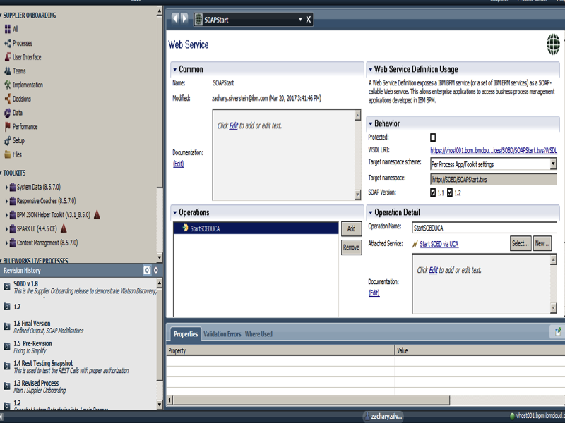

# Automatic Invocation
For starting the process via a SOAP Request, our service follows a fairly simple architecture.

Step 1. Send SOAP Request to exposed BPM Webservice

Step 2. BPM Catches SOAP Request with two parameters, product and company
Step 3. These parameters are fed directly into a General Systems Service that calls a UCA
Step 4. This UCA fires off and triggers a start node that follows the automatic invocation path mentioned inside our Process Organization readme. This can be seen in the overall process readme in the system path.

## Accessing the WSDL

To access the WSDL BPM-On-Cloud comes with SSO enabled, so an easy way to allow a SOAP request to connect to the WebService is to create a non- inter organization email account and add it as an approved user of the service and BPM on Cloud via BPM Admin Console. For instance we used a GMail account. This GMail account's credentials will be attached in the body as basic authentication to the SOAP request with email as user and password and password. 
