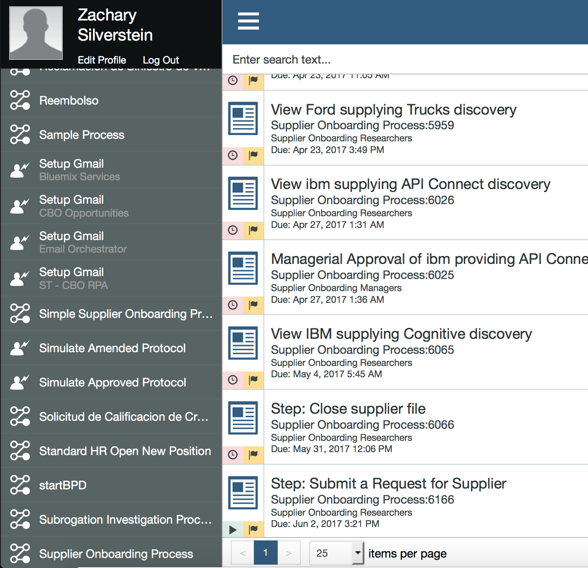

# Process Organization
Our Process has two main invocation ways.

## Manual invocation

This method is started via a user who has the Startable Service exposed via Process Portal. The user will click Simple Supplier Onboarding Process on the left hand side. This will generate a task to submit a request for a supplier as seen at the bottom. Here the user will manually enter the product and company. This information will be passed to the Discovery Service that pulls the task and then creates a task called View *company* Supplying *product* Discovery . This task will lead the user to the table of returned discovery results. The results are rated on 3 categories, the sentiment of the text inside, the score's relevancy, and the user's manual risk rating. If either are too low, we have a rule set up that automatically kicks this task to managerial approval, otherwise if it passes all rules set up, the task can be auto-routed to acceptance.

## Automatic Invocation

This method is similar to the manual invocation method, but we provide the option of being started via a SOAP Request. If started via the SOAP request, the step of the user manually generating a task will be skipped over and we will automatically create a  View *company* Supplying *product* Discovery for the Process Portal
