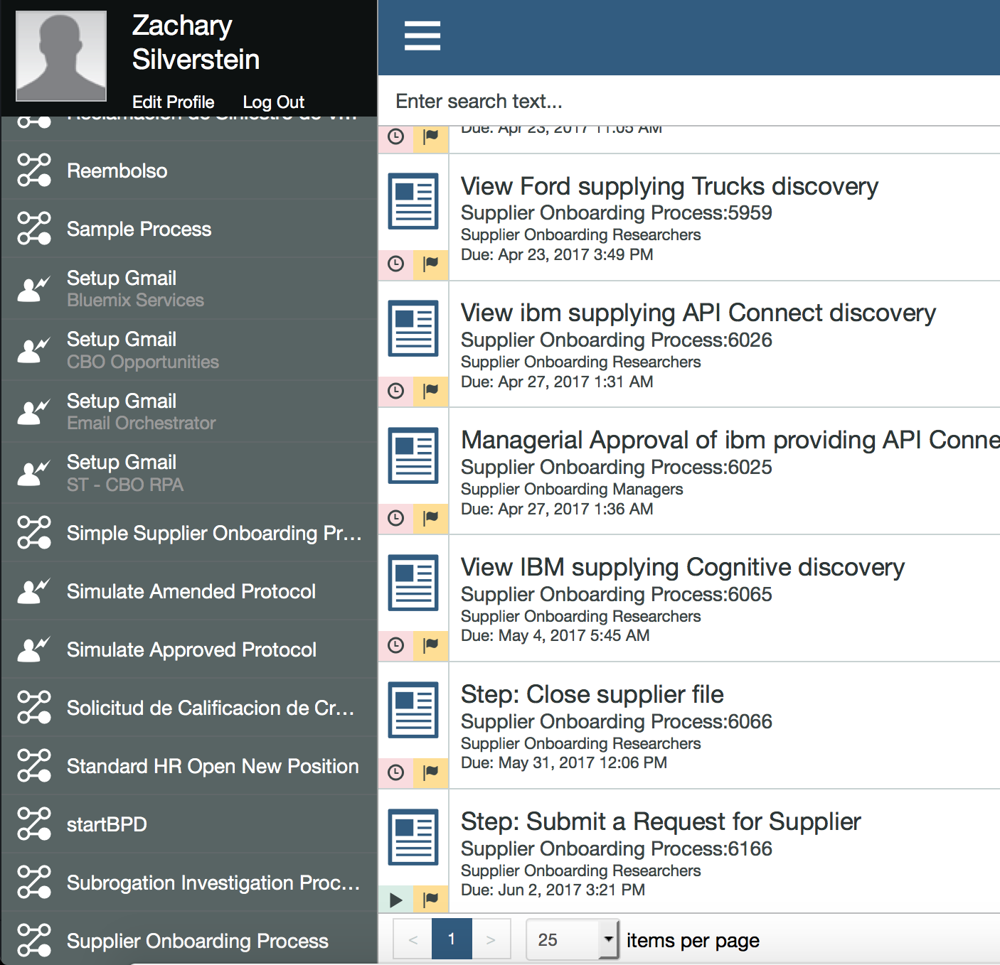
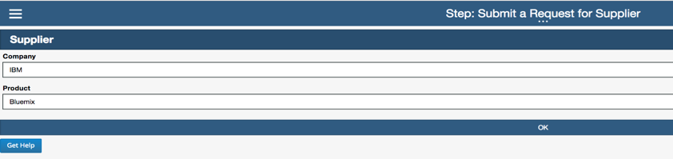
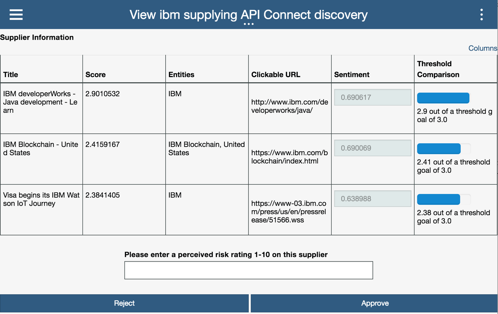
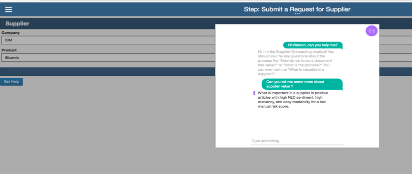
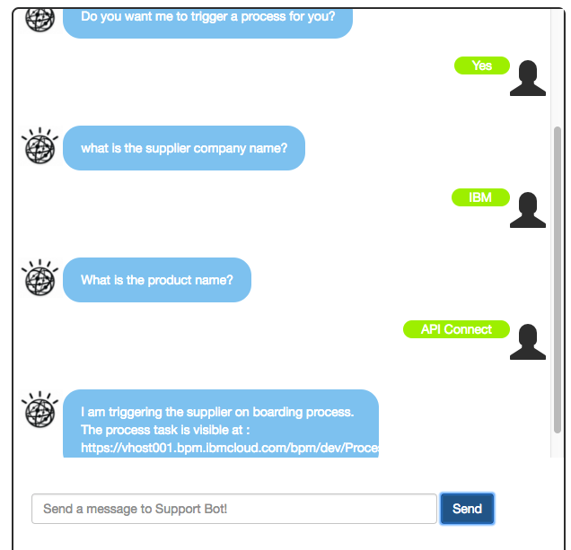

# Cognitive Architecture: Supplier On Boarding Business Process
This project defines a simple 'supplier on boarding process,' deployable on [IBM BPM on Cloud](http://www-03.ibm.com/software/products/en/business-process-manager-cloud), which uses Watson [Conversation Broker](ttps://github.com/ibm-cloud-architecture/refarch-cognitive-conversation-broker) and [Discovery broker](ttps://github.com/ibm-cloud-architecture/refarch-cognitive-discovery-broker).

This project is part of the 'IBM Cognitive Reference Architecture' suite, available at https://github.com/ibm-cloud-architecture/refarch-cognitive.

## Goals
The goal of the 'Supplier on-boarding' business process is to assess a Supplier application to make business with our mockup enterprise CASE Inc, which sells old computers and old IT stuffs. The process is human centric with calls to external data source or service like Watson Discovery to search for supplier name and product name within Watson News collection.
The process also demonstrates how to integrate Watson Conversation inside BPM Coaches to let the process user entering help request in natural language and get contextual answer.

The process flow is presented in the figure below, and it can be triggered by a member of the 'supplier researcher' team, or by a call to BPM as the process is exposed as a SOAP web service.

### Manual start

The process is started via a user who has the Startable Service exposed via Process Portal. The user will click Simple Supplier Onboarding Process on the left hand side. This will generate a task to submit a request for a supplier as seen at the bottom of the figure below.

Claiming the task, the user will manually enter the product and company.

This information will be passed to the Discovery Service via a query to the 'News' collection that pulls the task and then creates a task called View *company* Supplying *product* Discovery . This task will lead the user to the table of returned discovery results.

The results are rated on 3 categories, the sentiment of the text inside, the score's relevancy, and the user's manual risk rating.

If either are too low, the process has a rule set up that automatically kicks this task to managerial approval, otherwise if it passes all rules set up, the task can be auto-routed to acceptance.

### Automatic Invocation

The second way to start the process is by doing a remote call to an exposed web service. This method is similar to the manual invocation method, but we provide the option of being started via a SOAP Request. When started via the SOAP request, the step of the user manually generating a task will be skipped over and we will automatically create a  View *company* Supplying *product* Discovery for the Process Portal.
For more information on how the exposed service is done and how the client code is coded in Watson Conversation Broker read this [article](AutomaticInvocation.md).

## Prerequisites
To be able to run this demonstration you will need the following:
* Access to IBM BPM on-premise installation, or IBM on Cloud instance
* Write access to the Process Center to define new Process Definition or to upload the one proposed  [here](bpm/Supplier_OnBoarding)
* Deploy the process and verify it is start-able from Process Portal
* A Bluemix account
* A Watson Conversation service in Bluemix and your own version of the [Conversation Broker](ttps://github.com/ibm-cloud-architecture/refarch-cognitive-conversation-broker). Follow the instruction of this project.
* A Watson Discovery services in bluemix and your own version of the [Discovery broker](ttps://github.com/ibm-cloud-architecture/refarch-cognitive-discovery-broker).

## BPM Process Deployment
The IBM BPM .twx file is under the bpm folder and should be uploaded to your BPM on Cloud instance Process Center or your IBM BPM Process Center. It is based on version 8.5.7.

## Installing and Running

To install this process, take the TWX file that is provided and download it. Next navigate to the Process Center of your BPM on Cloud instance and click Import Process App on the right. Next you will go through the steps of importing the app. It should appear in your Process Center after importation is complete. Next click Open in Designer, ensure that the team definition has your userid listed in. After that, go to Process Portal and launch the Simple Supplier Onboarding Process.

### Call help in coach
From a coach a **Get help** button can trigger a chat with Watson conversation.

### Demonstration from Conversation
When accessing the CASE Inc internal portal at the URL [http://caseincapp.mybluemix.net/](http://caseincapp.mybluemix.net/) a user can access the Help@Case IT support application, which trigger a conversation. In the entry field enter the message: **what is the process for supplier on boarding?**.
The response is: **Do you want me to trigger a process for you?**
The bot ask about company and product name and then return the URL of the process portal to claim the task to continue the Onboarding process.

## How it is built
To understand how the Watson Discovery integration within the business process is done read this [article](bpm-wds-integration.md)

For the Call to Watson Conversation within a coach read this [article](bpm-wds-integration.md)

For calling the BPM exposed SOAP service see the article in [conversation broker](https://github.com/ibm-cloud-architecture/refarch-cognitive-conversation-broker/blob/master/doc/integrate-bpm.md)

# Contribute
You an help us enhancing the content, the development process is described in the [main cognitive repository](https://github.com/ibm-cloud-architecture/refarch-cognitive).
