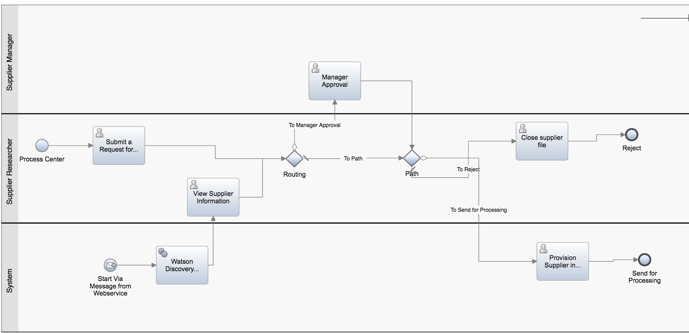

# Cognitive Architecture: Supplier On Boarding Business Process
This project offers a set of simple APIs in front of Watson Conversation to be consumed by your web interface, your mobile app  or even a business process defined in [IBM BPM on Cloud](http://www-03.ibm.com/software/products/en/business-process-manager-cloud).

This project is part of the 'IBM Cognitive Reference Architecture' suite, available at https://github.com/ibm-cloud-architecture/refarch-cognitive.

## Goals
The goal of the 'Supplier on-boarding' business process is to assess a Supplier application to make business with our mockup enterprise CASE Inc, which sells old computers and IT stuffs. The process is human centric with call to external data source or service like Watson Discovery to search for supplier name and product name within Watson News collection.
The process also demonstrates how to integrate Watson Conversation inside BPM Coaches so contextual, language natural query can be done by the process users to get help.

## Prerequisites
To be able to run this demonstration you will need the following:
* Access to IBM BPM on-premise installation, or IBM on Cloud instance
* Write access to the Process Center to define new Process Definition or to upload the one [here](bpm/Supplier_OnBoarding)
* A Bluemix account
* A Watson Conversation and Watson Discovery services.

## Demonstration script

## BPM Process Deployment
The IBM BPM .twx file is under the bpm folder and should be uploaded to your BPM on Cloud instance Process Center or your IBM BPM Process Center. It is based on version 8.5.7.

# Contribute
See the process in [main cognitive repository](https://github.com/ibm-cloud-architecture/refarch-cognitive).
