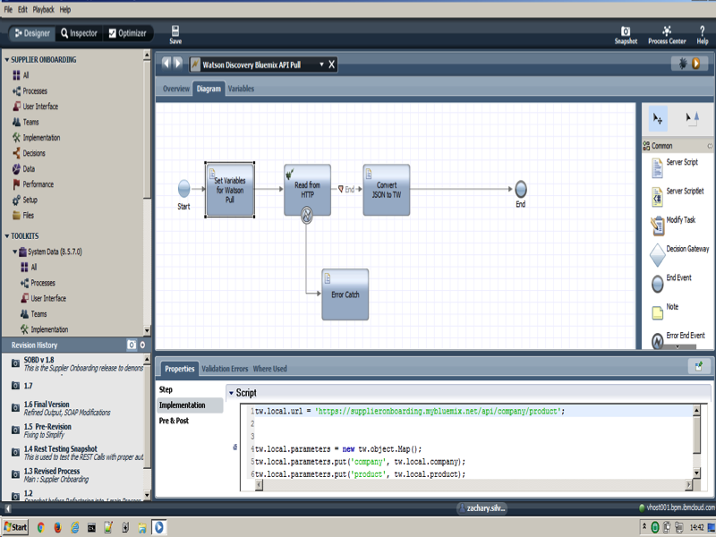
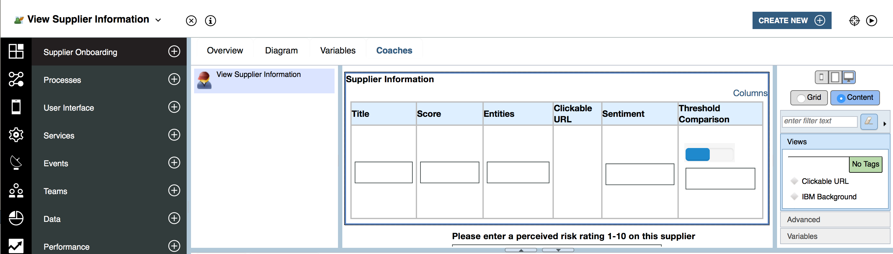
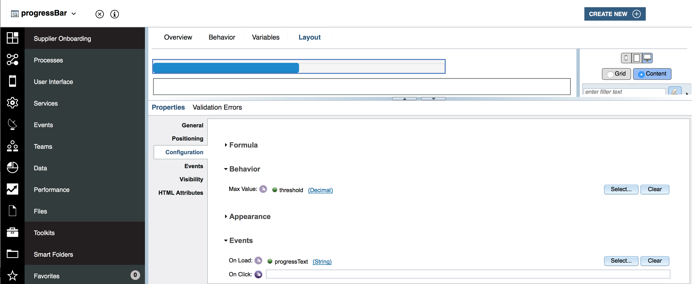

# Watson Discovery Readme

## Integration
The Watson Discovery service was integrated via a node.JS microserver that accessed the Watson Discovery service via this API
`var DiscoveryV1 = require('watson-developer-cloud/discovery/v1');`. What this allowed is us to easily host a microserver that accepted postRequests with 2 parameters, product and company. The flow of this service is, BPM fires a ReadFromHTTP from the SystemData Dependency, with the 2 parameters attached as parameters, the node server is accessed, takes the two posted parameters, accesses the Discovery API, and returns the results as a JSON object to BPM.

## API Call JS


```
tw.local.url = 'https://supplieronboarding.mybluemix.net/api/company/product';


tw.local.parameters = new tw.object.Map();
tw.local.parameters.put('company', tw.local.company);
tw.local.parameters.put('product', tw.local.product);
```


## Formatting Our Return

We need another toolkit to parse our JSON object into a TW Object. The name of this toolkit is JSON Helper
[BPM JSON Helper TK](https://developer.ibm.com/bpm/resources/json-helper-toolkit/). A DWRecipe Guide can be accessed
[here](https://developer.ibm.com/recipes/tutorials/parsing-returned-data-from-a-nodejs-server-inside-bpm-via-http/) detailing usage.

```
    tw.local.formattedReturn = new tw.object.listOf.FormattedDiscoveryReturn();
    tw.local.formattedReturn = BPMJSON.convertJSONToTw(tw.local.watsonReturn);

    for(var i =0; i<tw.local.formattedReturn.listLength;i++)
    {
    tw.local.formattedReturn[i].stringifiedEntities = ''; //Make stringified entities not null

    for(var j =0; j < (tw.local.formattedReturn[i].entities.listLength - 1); j++)
       {
         tw.local.formattedReturn[i].stringifiedEntities = tw.local.formattedReturn[i].stringifiedEntities + tw.local.formattedReturn[i].entities[j] + ', ';
       }

     tw.local.formattedReturn[i].stringifiedEntities = tw.local.formattedReturn[i].stringifiedEntities + tw.local.formattedReturn[i].entities[tw.local.formattedReturn[i].entities.listLength-1];
     if(tw.local.formattedReturn[i].entities.listLength == 1)
         {tw.local.formattedReturn[i].stringifiedEntities = tw.local.formattedReturn[i].entities[0]}


     }
```

## Presenting On A Coach



After we format our information into our business object, we take it and simply connect it to an out of the box coach. We add some slight extra functionality such as a progress bar and a clickable URL.

### Progress Bar Coachview


(Found in InlineJS of the Coachview)

```

var threshold = '';
var score = this.context.binding.get('value').score.toString();
score = score.substring(0,4)
score = parseFloat(score);
threshold = score + ' out of a threshold goal of ' + this.context.options.threshold.get('value')
this.context.options.thresholdText.set('value',threshold);
this.context.options.progressText.set('value','me.setProgress('+score+')');
```
 
 
 
### Clickable URL Coachview

Inline JS

```
var _this = this;

 function clicked () {
 	_this = _this;
	window.open( _this.context.binding.get('value'));
 }

```

View

```
var urlBox =  this.context.getSubview('Text2')[0].context.element

urlBox.addEventListener('click', clicked);
```
