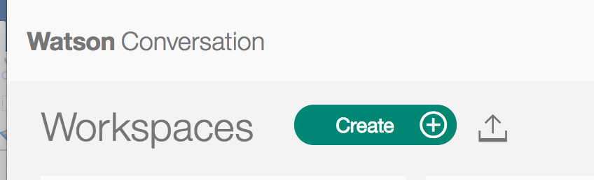
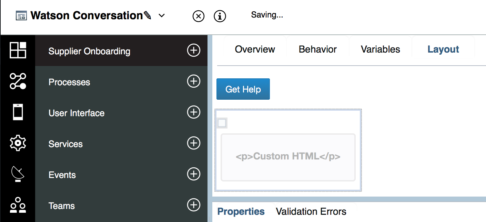

# Watson Conversation Readme

## Base Integration with BPM
The Watson Conversation is connected to the BPM Coach via a simple coach view. This coach view contains a chunk of custom HTML held in an iframe that opens up a window of the Conversation broker deployed on Bluemix. The user interface for the chat is then visible inside the frame. The Conversation we are accessing here is the exact same one that you would get when you build your Watson Conversation inside Bluemix.

## The specific support conversation
The Watson conversation workspace is available as source code under the wcs folder. Perform the following steps to deploy it into your own service.
* Create a Watson Conversation service
* Import the workspace [wcs/bpm-sobd-wksp.json](wcs/bpm-sobd-wksp.json) using the import button in the Conversation tool:

* Get the credential for the service

## Coach View


As far as the Coachview we simply utilize some SparkUI functionality to trigger a modal's visibility.

The Spark UI Button has this event configuration option set for onClick

`${Modal_Section2}.setVisible(true);`

In this case the `Modal_Section2` is the modal's Control ID

The chunk of custom HTML text inside the modal's content box is listed below

```
    <body>
    <iframe src="https://supplieronboardingconversationnode.mybluemix.net/" width = 400 height =500 allowtransparency="false" style=  'Background : White'>
    </iframe>
    </body>
```
